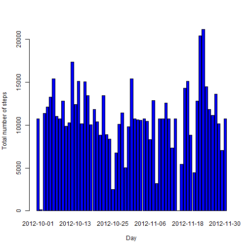

## Loading and preprocessing the data

```r
unzip("activity.zip")
data <- read.csv("activity.csv",
                 header=TRUE,
                 na.strings = "NA",
                 col.names=c("steps","date","interval"))

#Transforming the "date" column from string to date
date <- as.Date(data$date,"%Y-%m-%d")
```


# What is mean total number of steps taken per day?
##Calculate the total number of steps taken per day

```r
Total <- aggregate(steps ~ date, data = data, sum, na.rm = TRUE)
sum(Total$steps)
```

```
## [1] 570608
```

#Make a histogram of the total number of steps taken each day

```r
barplot(Total$steps, names.arg = Total$date, col="blue", xlab = "Day", ylab = "Total number of steps")
```

 

#Calculate and report the mean and median of the total number of steps taken per day

```r
mean(Total$steps)
```

```
## [1] 10766.19
```

```r
median(Total$steps)
```

```
## [1] 10765
```

# What is the average daily activity pattern?
##Make a time series plot of the 5-minute interval and the average number of steps taken, averaged across all days

```r
TotalInterval <- aggregate(steps ~ interval, data = data, mean, na.rm = TRUE)

plot(TotalInterval$steps, type = "l",col="blue", xlab = "5-min intervals", ylab = "Average number of steps")
```

 

#Which 5-minute interval, on average across all the days in the dataset, contains the maximum number of steps?


```r
TotalInterval[TotalInterval$steps == max(TotalInterval$steps),]$interval
```

```
## [1] 835
```

# Imputing missing values
##Calculate and report the total number of missing values in the dataset

```r
sum(is.na(data$steps))
```

```
## [1] 2304
```

#Devise a strategy for filling in all of the missing values in the dataset
##Missing values were imputed by inserting the average for each interval

```r
meanInterval <- aggregate(steps ~ interval, data = data, mean, na.rm = TRUE)
newData <- data 
for (i in 1:nrow(newData)) {
    if (is.na(newData$steps[i])) {
        newData$steps[i] <- meanInterval[which(newData$interval[i] == meanInterval$interval), ]$steps
    }
}
```

## Make a histogram of the total number of steps taken each day

```r
NewTotal <- aggregate(steps ~ date, data = newData, sum, na.rm = TRUE)
barplot(NewTotal$steps, names.arg = NewTotal$date, col="blue", xlab = "Day", ylab = "Total number of steps")
```

 

## Calculate and report the mean and median total number of steps taken per day

```r
mean(NewTotal$steps)
```

```
## [1] 10766.19
```

```r
median(NewTotal$steps)
```

```
## [1] 10766.19
```
### The mean stayed the same, and the median had a slight change 
### Imputingdoesn't have an impacton the total number of steps

## Are there differences in activity patterns between weekdays and weekends?

```r
week <- function(date) {
    if (weekdays(as.Date(date)) %in% c("samedi", "dimanche")) {
        "weekend"
    } else {
        "weekday"
    }
}
newData$daytype <- as.factor(sapply(newData$date, week))
```


##Make a time series plot of the 5-minute interval and the average number of steps taken, averaged across all days

```r
TotalIntervalWeekDays <- aggregate(steps ~ interval, data = newData,  subset = newData$daytype == "weekday", FUN=mean)

TotalIntervalWeekEnds <- aggregate(steps ~ interval, data = newData,  subset = newData$daytype == "weekend", FUN=mean)

par(mfrow=c(2,1))

plot(TotalIntervalWeekDays$steps, type = "l",col="blue", xlab = "5-min intervals", ylab = "Average number of steps", main = "Week Days")

plot(TotalIntervalWeekEnds$steps, type = "l",col="blue", xlab = "5-min intervals", ylab = "Average number of steps",main = "Week Ends")
```

 
    
